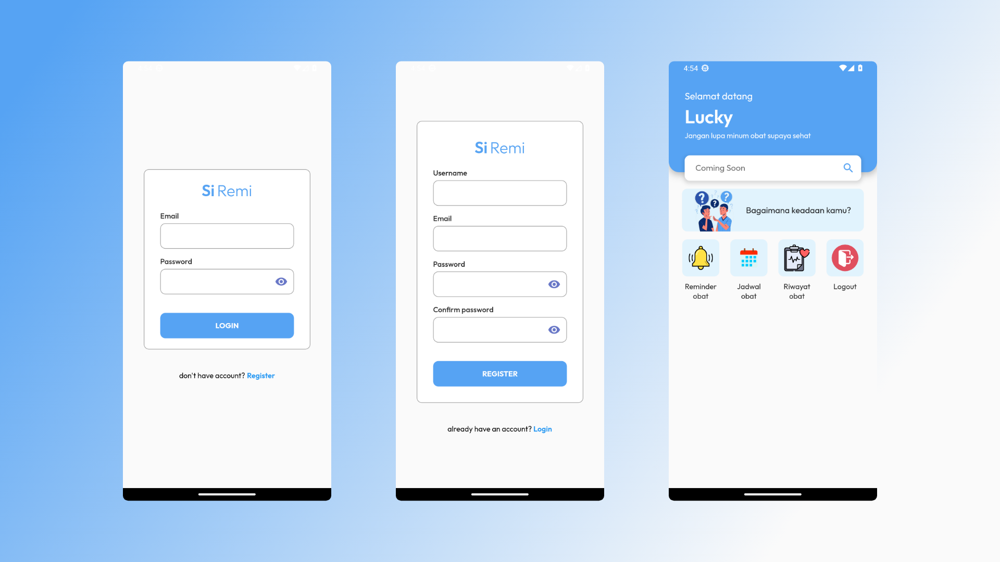
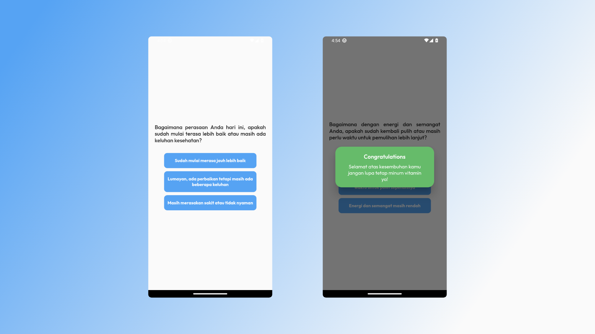
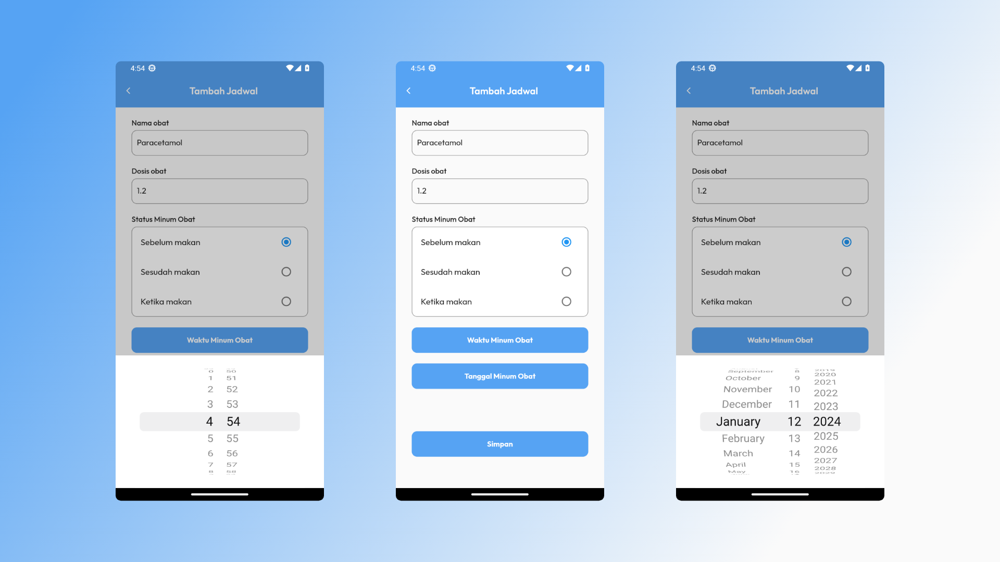
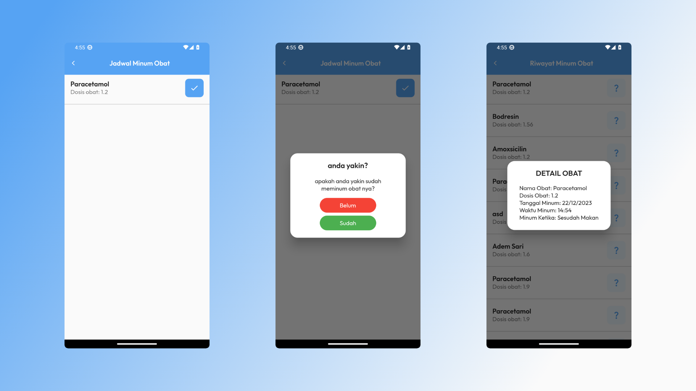

# Siremi - Aplikasi Pengingat Minum Obat 🕒💊

Siremi, singkatan dari "Si Reminder", adalah aplikasi inovatif untuk membantu Anda mengingat waktu minum obat secara teratur. Dengan fitur-fitur canggih, Siremi membuat manajemen jadwal minum obat menjadi lebih mudah dan efektif.

## Fitur Utama:

### 1. Autentikasi Firebase
- Siremi menggunakan Firebase Authentication untuk login dan registrasi aplikasi, memberikan keamanan ekstra untuk pengguna.

### 2. Penyimpanan Berkas Firebase
- Firebase Storage digunakan untuk menyimpan beberapa file, memungkinkan pengguna menyimpan catatan atau informasi penting terkait obat.

### 3. Pengingat Minum Obat
- Gunakan Siremi untuk menyetel waktu pengingat minum obat, memastikan Anda tidak melewatkan jadwal minum yang penting.

### 4. Local Push Notification
- Siremi mengintegrasikan flutter pub.dev Local Push Notification untuk memberikan notifikasi tepat waktu, memperingatkan pengguna tentang jadwal minum obat.

### 5. Otomatis Berhenti Notifikasi
- Notifikasi pengingat berhenti secara otomatis ketika pengguna telah mengonsumsi obat, memastikan ketepatan dan menghindari kebingungan.

### 6. Riwayat Minum Obat
- Siremi menyimpan riwayat minum obat yang ditampilkan dengan rinci, mencakup informasi tentang obat dan detail pengonsumsian. Riwayat ini memberikan pandangan menyeluruh tentang kepatuhan pengguna terhadap jadwal minum obat.

## Screenshots Aplikasi

Dengan Siremi, tidak perlu khawatir lagi tentang melewatkan jadwal minum obat. Aplikasi ini memberikan pengingat yang efisien dan riwayat yang terperinci, menjadikannya teman setia dalam menjaga kesehatan Anda. 🌟